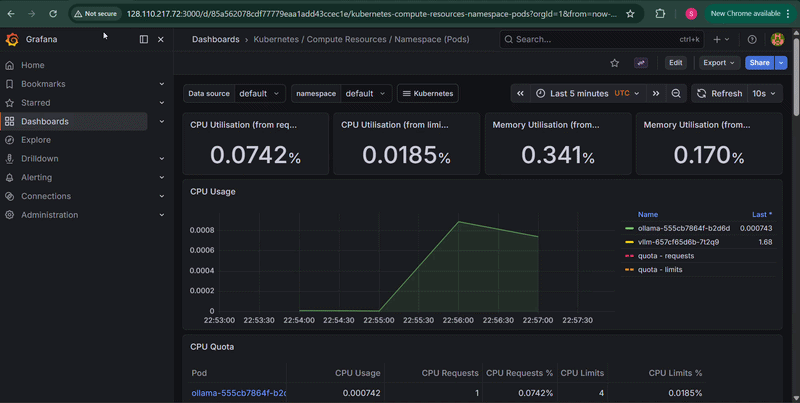
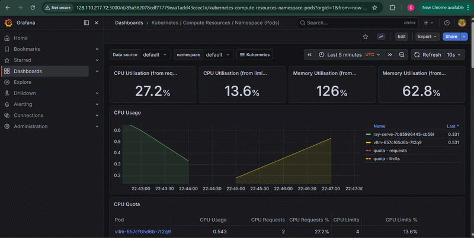
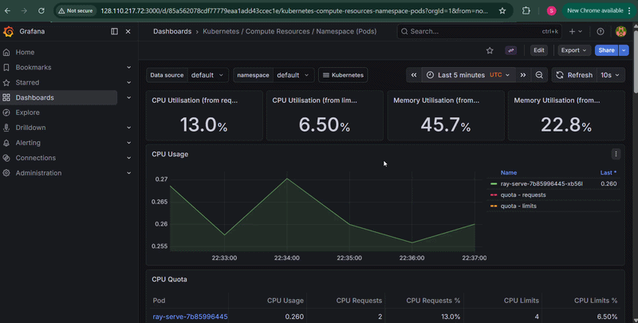

# LLM Serving Benchmark on Kubernetes

Comparing three LLM serving frameworks deployed on a self-hosted Kubernetes cluster (CloudLab) by measuring throughput and latency under concurrent load.

## Frameworks Compared
- **vLLM** - optimized LLM inference engine with continuous batching
- **Ollama** - lightweight LLM serving with simple REST API
- **Ray Serve** - general-purpose distributed Python serving framework

## Cluster Setup
- 3-node Kubernetes cluster on CloudLab (Ubuntu 20.04)
- **Platform:** CloudLab Utah cluster, Node type: m510 (8-core Intel Xeon D-1548, 64GB RAM, x86_64)
- node0: control plane
- node1: Ollama + vLLM (benchmarked in isolation - one scaled to 0 while the other ran)
- node2: Ray Serve
- Monitoring: Prometheus + Grafana (kube-prometheus-stack)

## Experiment Setup
- Model: TinyLlama 1.1B (CPU inference, no GPU)
- Load testing: Locust (10 concurrent users, 2 minutes per framework, 100 tokens per request)
- Each framework benchmarked in isolation (other deployments scaled to 0 replicas)
- Same prompt for all frameworks: "What is machine learning?"

## Results

| Metric | Ollama | Ray Serve | vLLM |
|--------|--------|-----------|------|
| Total Requests (2 min) | 16 | 13 | 25 |
| Throughput | 0.14 req/s | 0.11 req/s | 0.22 req/s |
| Avg Latency | 50s | 55s | 31s |
| Min Latency | 9.5s | 8.4s | 1.3s |
| p50 Latency | 61s | 58s | 16s |
| p95 Latency | 69s | 98s | 97s |
| Failures | 0 | 0 | 0 |

## Key Findings
- vLLM achieved **57% higher throughput** than Ollama and **2x higher** than Ray Serve
- vLLM had the lowest average latency (31s) due to continuous batching
- Ollama showed low CPU utilization despite 10 concurrent users due to serial request processing
- Under sustained load, vLLM and Ray Serve both showed high p95 latency (~97s) due to request queue buildup
- Ollama showed more consistent tail latency (p95: 69s) despite lower overall throughput
- Ray Serve performed worst overall - it is a general-purpose serving framework, not optimized for LLM inference

## Monitoring

**Ollama - CPU usage during benchmark**

**vLLM - CPU usage during benchmark**

**Ray Serve - CPU usage during benchmark**

## Limitations
- CPU-only inference - results would differ significantly with GPU
- Small scale (2 worker nodes, single replica per framework)
- Short benchmark duration (2 minutes per framework)
- Single model tested (TinyLlama 1.1B)
- Single prompt used for all requests

## Repo Structure
- `locust_ollama.py` / `locust_vllm.py` / `locust_ray.py` - Locust benchmark scripts
- `results_*2_stats.csv` - Final clean benchmark results
- `ollama-deployment.yaml` / `vllm-deployment.yaml` / `ray-serve-deployment.yaml` - Kubernetes deployment configs
- `services.yaml` - Kubernetes services

## How to Reproduce
Deployment YAMLs and Locust benchmark scripts are included in this repository.
Tested on a 3-node Kubernetes cluster (CloudLab, Ubuntu 20.04).
